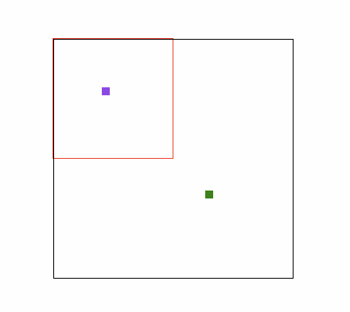

# burnout.js

> :video_game: The 2D game engine for manage collisions. Made with javascript and CSS Grid Layout. :heartbeat:

## Features

- Grid based map (Powered by Grid Layout API).
- Create and position blocks in the map (Following the Grid Layout API).
- Create an avatar for playing the game.
- Set different styles for all avatar sides.
- Register blocks for collisions with avatar (with configurable callbacks).
- Register blocks for avatar over (with configurable callbacks).
- Set keyboard commands for control the avatar into the map.
- Developer mode for easily style the map.
- Easily access to map, view, avatar and blocks DOM references.

## How to use?

### Install

**Tip:** Verify if you have [node](http://nodejs.org/) and [yarn](https://yarnpkg.com/pt-BR/) installed.

```sh
$ yarn add burnoutjs
```

### Setup

#### ES6/ECMAScript 2015 module:

**Tip:** Use [Webpack](https://webpack.github.io/) (or similar module bundler) to manage the components.

```js
import burnout from 'burnoutjs';
```

#### CommonJS module:

**Tip:** Use [Browserify](http://browserify.org/) (or similar module bundler) to manage the components.

```js
const burnout = require('burnoutjs');
```

### Create you game

#### 1 - Define your map:

```js
burnout.defineMap({
  developer: true,
  blockSize: 10,
  map: {
    cols: 30,
    rows: 30,
  },
  view: {
    cols: 15,
    rows: 15,
  },
});
```

#### 2 - Create as many blocks as you like:

*A simple block*

```js
burnout.defineBlock({
  className: 'block',
  position: {
    rowStart: 20,
    columnStart: 20,
    rowEnd: 21,
    columnEnd: 21,
  }
});
```

*A block with collision and callback action*

```js
burnout.defineBlock({
  className: 'wall',
  collision: true,
  position: {
    rowStart: 20,
    columnStart: 20,
    rowEnd: 21,
    columnEnd: 21,
    action: (blockPosition) => {
      console.log(blockPosition);
    },
  }
});
```

*A block with over and callback action*

```js
burnout.defineBlock({
  className: 'grass',
  over: true,
  position: {
    rowStart: 20,
    columnStart: 20,
    rowEnd: 21,
    columnEnd: 21,
    action: (blockPosition) => {
      console.log(blockPosition);
    },
  }
});
```

#### 3 - Define your avatar.

```js
burnout.defineAvatar({
  className: 'player',
  side: {
    up: 'player--up',
    down: 'player--down',
    left: 'player--left',
    right: 'player--right',
  },
  position: {
    rowStart: 7,
    columnStart: 7,
    rowEnd: 8,
    columnEnd: 8,
  },
  static: false,
});
```

#### 4 - Set all game controls.

```js
burnout.defineControls({
  keyboard: {
    up: 38,
    down: 40,
    left: 37,
    right: 39,
  }
});
```

#### 5 - Render the game in the DOM.

```js
const container = document.getElementById('anyDomElement');
burnout.renderMap(container);
```
#### Result (with a collision block):

*Collision example with keyboard controls:*



- Red border: Camera/view of the game.
- Black border: All game map.
- Purple block: The avatar controlled via keyboard.
- Green block: A single block for collision.

### More features

```js
burnout.getMap();
```

```js
burnout.getView();
```

```js
burnout.getAvatar();
```

```js
burnout.getBlock({
  rowStart: 10,
  columnStart: 10,
  rowEnd: 11,
  columnEnd: 11,
});
```

<hr>

## Development

### Getting started

Clone this repository and install its dependencies:

```sh
$ git clone https://github.com/afonsopacifer/burnoutjs.git
$ cd burnoutjs
$ yarn
```
### Build

Builds the library to dist:

```shev
$ yarn build
```

Builds the library, then keeps rebuilding it whenever the source files change using [rollup-watch](https://github.com/rollup/rollup-watch):

```sh
$ yarn dev
```

### Code Style

Follow the [JS Code Style Guide](https://github.com/afonsopacifer/code-style-guide/blob/master/js/JS.md) by [Afonso Pacifer](https://github.com/afonsopacifer).

*All code style are automatic validate with [ESLint](http://eslint.org/):*

### Tests

*Run all unit tests:*

```sh
$ yarn test
```

<hr>

## Versioning

To keep better organization of releases we follow the [Semantic Versioning 2.0.0](http://semver.org/) guidelines.

## Contributing

Want to contribute? [Follow these recommendations](https://github.com/afonsopacifer/burnoutjs/blob/master/CONTRIBUTING.md).

## History

See [Releases](https://github.com/afonsopacifer/burnoutjs/releases) for detailed changelog.

## License

[MIT License](https://github.com/afonsopacifer/burnoutjs/blob/master/LICENSE.md) © [Afonso Pacifer](https://github.com/afonsopacifer)
